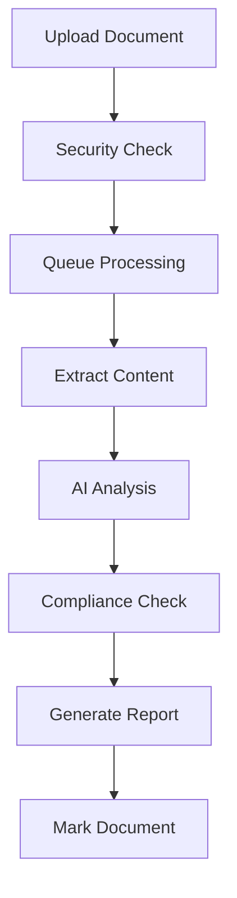
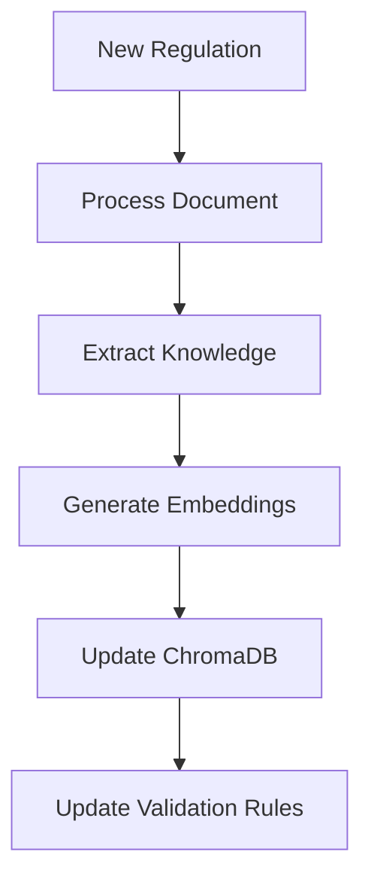

# ADGM Corporate Agent - Project Planning Document
---
## NOTE
I’m really grateful for this opportunity and excited to have made it to this stage. I’ve done my best to put this plan together with the information provided, and I’m more than happy to take on any feedback or suggestions to make it better. Working on this was a great learning experience, and I’d love the chance to join 2Cents Capital, keep learning, grow alongside the team, and contribute in a meaningful way.

***

## Overview

The ADGM Corporate Agent is designed to streamline and automate the validation of corporate documents for Abu Dhabi Global Market (ADGM) compliance. This document outlines the planning, architecture, and implementation details of the project.

## 🎯 Project Goals

1. **Primary Objectives**
   - Automate document compliance checking
   - Reduce manual review time
   - Ensure consistent validation
   - Provide actionable feedback
   - Maintain up-to-date regulatory knowledge

2. **Key Challenges**
   - Complex regulatory requirements
   - Document structure variation
   - Need for accurate analysis
   - Real-time processing demands
   - Knowledge base maintenance

## 🏗️ System Architecture

### Core Components

1. **Document Processing Pipeline**
   - Input: DOCX files
   - Processing stages:
     1. File validation & security checks
     2. Text extraction & structure analysis
     3. AI-powered content analysis
     4. Compliance validation
     5. Report generation
   - Output: Analysis reports & marked documents

2. **Knowledge Management System**
   - ChromaDB vector database
   - Document embeddings
   - Regulatory knowledge storage
   - Template management
   - Regular updates capability

3. **AI Analysis Engine**
   - Gemini 2.0 Flash integration
   - Rate-limited API calls (10/minute)
   - Structured prompt templates
   - Fallback mechanisms
   - Context-aware analysis

## 💡 Design Decisions

### 1. Technology Stack Selection

- **FastAPI Framework**
  - Reason: Async support, automatic API docs, high performance
  - Benefits: Real-time processing, scalability, easy integration

- **ChromaDB**
  - Reason: Vector search capabilities, easy embedding storage
  - Benefits: Fast similarity search, efficient knowledge retrieval

- **Gemini 2.0 Flash**
  - Reason: Advanced language understanding, fast processing
  - Benefits: Accurate analysis, structured outputs

### 2. File Processing

- **Format Choice: DOCX**
  - Reason: Common format for legal documents
  - Benefits: Rich text support, metadata access

- **Processing Strategy**
  - Async background processing
  - Queue-based system
  - Progress tracking
  - Resource cleanup

### 3. Validation Architecture

- **Multi-level Validation**
  1. Basic Structure Check
     - Required sections
     - Document format
     - File integrity

  2. Content Analysis
     - AI-powered understanding
     - Pattern matching
     - Cross-referencing

  3. Compliance Check
     - Regulatory requirements
     - Industry standards
     - Best practices

## 🔄 Workflows

### 1. Document Analysis Workflow

### 2. Knowledge Base Update Workflow

## 🛠️ Implementation Strategy

### 1. Core Services

1. **Document Parser**
   - Purpose: Extract and structure document content
   - Features: Section detection, metadata extraction
   - Implementation: `document_parser.py`

2. **Gemini Analyzer**
   - Purpose: AI-powered document analysis
   - Features: Content understanding, red flag detection
   - Implementation: `gemini_analyzer.py`

3. **ADGM Validator**
   - Purpose: Compliance checking
   - Features: Rule validation, score calculation
   - Implementation: `adgm_validator.py`

### 2. Data Models

Structured using Pydantic for validation:

1. **Document Models**
   - DocumentType (enum)
   - ProcessingStatus (enum)
   - DocumentFlag
   - ComplianceCheck

2. **Analysis Models**
   - DocumentAnalysis
   - AnalysisReport
   - APIResponse

## 🔒 Security Considerations

1. **File Security**
   - Size limits (50MB max)
   - Format validation
   - Malware scanning potential

2. **API Security**
   - Rate limiting
   - API key protection
   - Input sanitization

3. **Data Protection**
   - Temporary file cleanup
   - Secure storage
   - Access controls

## 📈 Performance Optimization

1. **Processing Optimization**
   - Async operations
   - Background tasks
   - Chunked processing

2. **Resource Management**
   - Connection pooling
   - Memory efficient operations
   - Cleanup routines

## 🧪 Testing Strategy

1. **Unit Testing**
   - Individual component tests
   - Mock API responses
   - Edge case handling

2. **Integration Testing**
   - End-to-end workflows
   - API endpoint testing
   - Performance benchmarks

## 📚 Knowledge Base Management

1. **Data Sources**
   - ADGM regulations
   - Templates
   - Best practices
   - Historical analyses

2. **Update Mechanism**
   - Regular scraping
   - Manual additions
   - Automated processing

## 🔄 Maintenance Plan

1. **Regular Updates**
   - Knowledge base refresh
   - Rule updates
   - API maintenance

2. **Monitoring**
   - Performance metrics
   - Error tracking
   - Usage statistics

## 🚀 Future Enhancements

1. **Planned Features**
   - Web interface
   - Multi-language support
   - Advanced workflows
   - Batch processing

2. **Integration Options**
   - ADGM systems
   - External APIs
   - Additional AI models

## 📋 Success Metrics

1. **Performance Metrics**
   - Processing time < 5 minutes
   - 95% accuracy in compliance checks
   - < 1% false positives

2. **User Metrics**
   - Reduced review time
   - Improved compliance
   - User satisfaction

## 💫 Conclusion

This plan outlines a robust, scalable, and efficient system for ADGM document compliance checking. The modular architecture allows for easy maintenance and future enhancements while maintaining high performance and accuracy standards.

